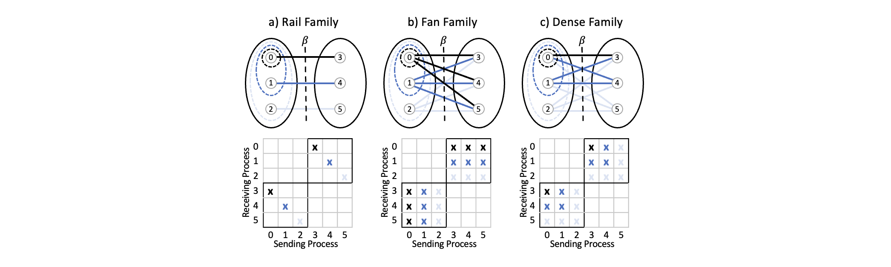

## Group-to-Group Benchmarking

To describe the performance behavior of communications across groups of processors, we define group-to-group patterns (i.e., Rail, Fan, and Dense). For gradually varying the number of devices involved in communication with various ways, we parameterize these patterns with configuration control variables $(p, g, k)$. To run CommBench, one needs to set a total of ten command line parameters as
```cpp
mpirun ./CommBench library pattern direction count window warmup numiter p g k
```
where
1. library: 0 for IPC, 1 for MPI, and 2 for NCCL
2. pattern: 1 for Rail, 2 for Fan, and 3 for Dense
3. direction: 1 for outbound, 2 for inbound, 3 for bidirectional and 4 for omnidirectional
4. count: number of 4-byte elements per message
5. window: number of messages per round
6. warmup: number of warmup rounds
7. numiter: number of measurement rounds
8. $p$: number of GPUs
9. $g$: group size
10. $k$: subgroup size

The best practice for using CommBench is to prepare a run script that sweeps over the desired parameters and directs the output into a file. Then, the user can "grep" the desired output for further analysis and plotting. Each system requires a special care considering the modules, environment variables, and configuration parameters. To compile and run CommBench out-of-the-box on six systems, we include Make files and run scripts in the `/script` as displayed below.

|Facility | System | Make File | Run Script |
| :--- | :---| :--- | :--- |
| NCSA | Delta | `Makefile_delta` | `run_delta.sh`  |
| OLCF | Summit | `Makefile_summit` | `run_summit.sh` |
| NERSC | Perlmutter | `Makefile_perlmutter` | `run_perlmutter.sh` |
| ALCF | ThetaGPU | `Makefile_thetagpu` | `run_thetagpu.sh` |
| OLCF | Frontier | `Makefile_frontier` | `run_frontier.sh` |
| ALCF | Sunspot | `Makefile_sunspot` | `run_sunspot.sh` |

There is an extension of CommBench for standard collectives in the ```CommBench/test_coll``` folder.

CommBench is the second (and final) iteration of the communication benchmarking tool. See https://github.com/merthidayetoglu/Bisection_Bandwidth_Tester for the previous version.

#### Configuration Parameters

We propose a few pre-implemented benchmarking patterns that isolates data movement acoss groups. There are three parameters, $p$, $g$, and $k$ to configure the benchmark, where $p$ is the total number of processors, $g$ is the group size, and $k$ is the subgroup size where the communication is initiated in the originating group.



To define benchmark configuration without ambiguity, one needs to specify $(p, g, k)$, pattern, and the direction of data movement.

#### Direction of Data Movement

For convenience, we define unidirectional, bidirectional, and omnidirectional data movement for the group communication patterns. The terminals of unidirectional and bidirectional data movement are located in the originating group. Omnidirectional data movement happens across all groups.


There are multiple examples in the ``group.cpp`` that implement the proposed group-to-group patterns. Each benchmarking pattern is parameterized and expressed in a few lines of code. Custom (e.g., application dependent) benchmarks can be configured similarly.

For questions and support, please send an email to merth@stanford.edu
